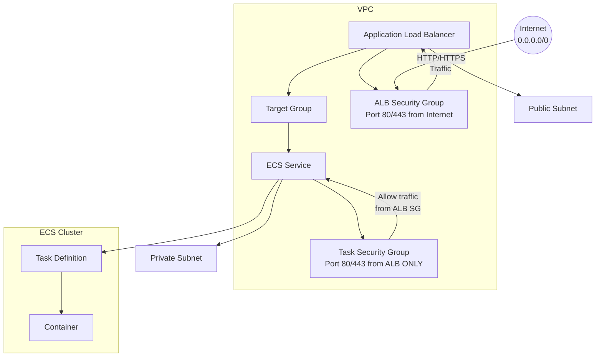

# EcsComponent Documentation

## Overview

The **EcsComponent** is a Pulumi TypeScript component that provides a complete, production-ready ECS (Elastic Container Service) deployment with Application Load Balancer (ALB), auto-scaling, and optional HTTPS support. It follows the **factoring pattern** (lazy resource creation) to optimize costs and allow flexible configuration.

### Purpose

- Deploy containerized applications to AWS ECS Fargate
- Automatically configure ALB with health checks
- Enable auto-scaling based on CPU utilization
- Support HTTPS termination with ACM certificates
- Allow external security group injection
- **Separate ALB and Task security groups for enhanced security**

---

## Architecture Diagram



### Security Group Architecture

```
┌─────────────────────────────────────────────────────────────────────────────┐
│                     SECURITY GROUP FLOW                                       │
├─────────────────────────────────────────────────────────────────────────────┤
│                                                                             │
│   INTERNET (0.0.0.0/0)                                                      │
│          │                                                                    │
│          ▼                                                                    │
│   ┌─────────────────┐     securityGroups      ┌─────────────────┐          │
│   │  ALB Security  │ ◄─────────────────────► │  Task Security  │          │
│   │     Group       │   reference (not CIDR)  │     Group       │          │
│   └────────┬────────┘                        └────────┬────────┘          │
│            │                                               │                 │
│            │ ingress: 0.0.0.0/0:80,443                    │ ingress:         │
│            │ egress: all                                 │   securityGroups │
│            ▼                                              │   : [albSG]      │
│         ALB                                               ▼                 │
│            │                                              ECS Tasks          │
│            │                                                                 │
└────────────┴────────────────────────────────────────────────────────────────┘
```

### Resources Created

| Resource | Type | Created By Default |
|----------|------|-------------------|
| ECS Cluster | AWS::ECS::Cluster | ✅ Always |
| Task Definition | AWS::ECS::TaskDefinition | ✅ Always |
| ECS Service | AWS::ECS::Service | ✅ Always |
| Application Load Balancer | AWS::ELB::LoadBalancer | ✅ Always |
| Target Group | AWS::ELBv2::TargetGroup | ✅ Always |
| HTTP Listener | AWS::ELBv2::Listener | ✅ Always |
| HTTPS Listener | AWS::ELBv2::Listener | ⚡ Lazy (if enabled) |
| ALB Security Group | AWS::EC2::SecurityGroup | ⚡ Lazy (if not provided) |
| **Task Security Group** | **AWS::EC2::SecurityGroup** | **⚡ Lazy (if not provided)** |
| Auto Scaling Target | AWS::ApplicationAutoScaling::ScalableTarget | ✅ Always |
| Auto Scaling Policy | AWS::ApplicationAutoScaling::ScalingPolicy | ✅ Always |

---

## Configuration Options

### TypeScript Interface

```typescript
import * as pulumi from '@pulumi/pulumi';

interface ContainerEnvironment {
  name: string;
  value: string;
}

interface ContainerSecret {
  name: string;
  valueFrom: string;
}

interface HealthCheckConfig {
  command?: string[];
  interval?: number;
  timeout?: number;
  retries?: number;
  startPeriod?: number;
}

interface EcsComponentArgs {
  // Basic Configuration
  Environment?: pulumi.Input<string>;
  clusterName?: pulumi.Input<string>;
  containerImage: pulumi.Input<string>;
  containerPort?: pulumi.Input<number>;
  
  // Task Configuration
  taskCpu?: pulumi.Input<string>;
  taskMemory?: pulumi.Input<string>;
  desiredCount?: pulumi.Input<number>;
  ecsType?: pulumi.Input<string>;
  
  // Network Configuration
  vpcId: pulumi.Input<string>;
  subnetIds: pulumi.Input<pulumi.Input<string>[]>;
  vpcSecurityGroupIds?: pulumi.Input<pulumi.Input<string>[]>;
  albSecurityGroupId?: pulumi.Input<string>;  // Lazy creation
  taskSecurityGroupId?: pulumi.Input<string>; // Lazy creation - SEPARATE from ALB!
  assignPublicIp?: pulumi.Input<boolean>;
  
  // Health Check Configuration
  healthCheck?: HealthCheckConfig;
  healthCheckGracePeriodSeconds?: pulumi.Input<number>;
  
  // Environment & Secrets
  environmentVariables?: ContainerEnvironment[];
  secrets?: ContainerSecret[];
  
  // IAM
  taskRoleArn?: pulumi.Input<string>;
  
  // HTTPS Configuration
  enableHttps?: pulumi.Input<boolean>;
  certificateArn?: pulumi.Input<string>;
  
  // Auto Scaling
  autoScalingConfig?: {
    minCapacity?: pulumi.Input<number>;
    maxCapacity?: pulumi.Input<number>;
  };
  coolingPeriod?: pulumi.Input<number>;
  targetCpuUtilization?: pulumi.Input<number>;
}
```

### Configuration Reference

| Property | Type | Default | Description |
|----------|------|---------|-------------|
| `Environment` | `string` | `"dev"` | Environment tag for resources |
| `clusterName` | `string` | `{name}-cluster` | Custom ECS cluster name |
| `containerImage` | `string` | **required** | Docker image URL (ECR, Docker Hub, etc.) |
| `containerPort` | `number` | `80` | Container port for ALB target group |
| `taskCpu` | `string` | `"256"` | CPU units for task (256, 512, 1024, etc.) |
| `taskMemory` | `string` | `"512"` | Memory in MB for task |
| `desiredCount` | `number` | `1` | Initial number of tasks |
| `ecsType` | `string` | `"FARGATE"` | Launch type (FARGATE or EC2) |
| `vpcId` | `string` | **required** | VPC ID for ALB and ECS |
| `subnetIds` | `string[]` | **required** | Subnet IDs for ALB and ECS tasks |
| `vpcSecurityGroupIds` | `string[]` | ALB SG only | Security groups for ECS tasks |
| `albSecurityGroupId` | `string` | auto-created | External ALB security group ID |
| `assignPublicIp` | `boolean` | `false` ⚠️ | Assign public IP (SECURITY: default FALSE for ALB-only access) |
| `healthCheck.command` | `string[]` | curl health check | Health check command |
| `healthCheck.interval` | `number` | `30` | Health check interval in seconds |
| `healthCheck.timeout` | `number` | `5` | Health check timeout in seconds |
| `healthCheck.retries` | `number` | `3` | Unhealthy threshold |
| `healthCheck.startPeriod` | `number` | `60` | Startup grace period |
| `healthCheckGracePeriodSeconds` | `number` | `60` | Initial delay before health checks |
| `environmentVariables` | `Array<{name, value}>` | `[]` | Environment variables for container |
| `secrets` | `Array<{name, valueFrom}>` | `[]` | Secrets from Secrets Manager |
| `taskRoleArn` | `string` | - | IAM role for task execution |
| `enableHttps` | `boolean` | `false` | Enable HTTPS on ALB |
| `certificateArn` | `string` | - | ACM certificate ARN (required if HTTPS enabled) |
| `autoScalingConfig.minCapacity` | `number` | `1` | Minimum number of tasks |
| `autoScalingConfig.maxCapacity` | `number` | `5` | Maximum number of tasks |
| `coolingPeriod` | `number` | `300` | Cooldown period in seconds |
| `targetCpuUtilization` | `number` | `50` | Target CPU % for auto-scaling |

---

## Lazy Creation Patterns

### 1. ALB Security Group (`albSecurityGroupId`)

The ALB security group is only created if no external security group ID is provided:

```typescript
// If you DON'T provide albSecurityGroupId:
// ✅ Creates new security group with HTTP/HTTPS ingress

// If you PROVIDE albSecurityGroupId:
// ⚡ Skips creation, uses your external security group
const ecs = new EcsComponent("myapp", {
  vpcId: network.vpc.id,
  subnetIds: network.publicSubnets.map(s => s.id),
  containerImage: "nginx:latest",
  albSecurityGroupId: "sg-0123456789abcdef0",  // Your existing SG
});
```

**Use Case**: Integrate with existing security group infrastructure.

### 2. HTTPS Listener (`enableHttps`, `certificateArn`)

The HTTPS listener is only created when both conditions are met:

```typescript
const ecs = new EcsComponent("myapp", {
  // ... other config
  enableHttps: true,
  certificateArn: "arn:aws:acm:us-east-1:123456789012:certificate/abc123",
});
```

**Behavior**:
- If `enableHttps: false` (default) → Only HTTP (port 80) listener created
- If `enableHttps: true` but no `certificateArn` → Error thrown
- If `enableHttps: true` with valid `certificateArn` → Both HTTP and HTTPS listeners created

---

## Usage Examples

### 1. Basic ECS Deployment

```typescript
import * as pulumi from '@pulumi/pulumi';
import { NetworkComponent } from './components/01-network-component';
import { EcsComponent } from './components/03-ecs-component';

const network = new NetworkComponent("myapp", {
  cidrBlock: "10.0.0.0/16",
});

const ecs = new EcsComponent("myapp", {
  vpcId: network.vpc.id,
  subnetIds: network.publicSubnets.map(s => s.id),
  containerImage: "nginx:latest",
  containerPort: 80,
});

// Output the ALB DNS name
export const albDnsName = ecs.loadBalancerDns;
```

### 2. ECS with Environment Variables

```typescript
const ecs = new EcsComponent("myapp", {
  vpcId: network.vpc.id,
  subnetIds: network.publicSubnets.map(s => s.id),
  containerImage: "myapp:latest",
  containerPort: 8080,
  environmentVariables: [
    { name: "NODE_ENV", value: "production" },
    { name: "API_URL", value: "https://api.example.com" },
    { name: "LOG_LEVEL", value: "info" },
  ],
});
```

### 3. ECS with HTTPS

```typescript
const ecs = new EcsComponent("myapp", {
  vpcId: network.vpc.id,
  subnetIds: network.publicSubnets.map(s => s.id),
  containerImage: "myapp:latest",
  containerPort: 443,
  enableHttps: true,
  certificateArn: "arn:aws:acm:us-east-1:123456789012:certificate/abc123",
});
```

### 4. ECS with Private Subnets and External Security Group

```typescript
// First, create network with private subnets
const network = new NetworkComponent("myapp", {
  cidrBlock: "10.0.0.0/16",
  enablePrivateSubnets: true,  // Creates NAT Gateway
});

// Then deploy ECS to private subnets
const ecs = new EcsComponent("myapp", {
  vpcId: network.vpc.id,
  subnetIds: network.privateSubnets.map(s => s.id),
  containerImage: "myapp:latest",
  assignPublicIp: false,  // No public IP for private subnet tasks
  vpcSecurityGroupIds: [network.privateSecurityGroup!.id],
  desiredCount: 2,
  autoScalingConfig: {
    minCapacity: 1,
    maxCapacity: 10,
  },
  targetCpuUtilization: 70,
});
```

### 5. ECS with Secrets from AWS Secrets Manager

```typescript
const ecs = new EcsComponent("myapp", {
  vpcId: network.vpc.id,
  subnetIds: network.publicSubnets.map(s => s.id),
  containerImage: "myapp:latest",
  secrets: [
    {
      name: "DATABASE_PASSWORD",
      valueFrom: "arn:aws:secretsmanager:us-east-1:123456789012:secret:db-password",
    },
    {
      name: "API_KEY",
      valueFrom: "arn:aws:ssm:us-east-1:123456789012:parameter/api-key",
    },
  ],
});
```

---

## Pulumi Configuration (YAML)

### Basic Configuration (Pulumi.dev.yaml)

```yaml
config:
  pulumi-aws-ts:Environment: dev
  pulumi-aws-ts:containerImage: nginx:latest
  pulumi-aws-ts:containerPort: "80"
  pulumi-aws-ts:desiredCount: "2"
  pulumi-aws-ts:taskCpu: "256"
  pulumi-aws-ts:taskMemory: "512"
  pulumi-aws-ts:targetCpuUtilization: "50"
  pulumi-aws-ts:coolingPeriod: "300"
```

### HTTPS Configuration

```yaml
config:
  pulumi-aws-ts:Environment: prod
  pulumi-aws-ts:enableHttps: "true"
  pulumi-aws-ts:certificateArn: arn:aws:acm:us-east-1:123456789012:certificate/abc123
```

### Auto Scaling Configuration

```yaml
config:
  pulumi-aws-ts:autoScalingConfig:
    minCapacity: "2"
    maxCapacity: "10"
  pulumi-aws-ts:targetCpuUtilization: "70"
  pulumi-aws-ts:coolingPeriod: "300"
```

---

## Exported Properties

| Property | Type | Description |
|----------|------|-------------|
| `serviceName` | `pulumi.Output<string>` | ECS service name |
| `serviceArn` | `pulumi.Output<string>` | ECS service ARN |
| `clusterName` | `pulumi.Output<string>` | ECS cluster name |
| `clusterArn` | `pulumi.Output<string>` | ECS cluster ARN |
| `loadBalancerDns` | `pulumi.Output<string>` | ALB DNS name |
| `albArn` | `pulumi.Output<string>` | ALB ARN |
| `targetGroupArn` | `pulumi.Output<string>` | Target Group ARN |
| `listenerArn` | `pulumi.Output<string>` | HTTP Listener ARN |
| `httpsListenerArn` | `pulumi.Output<string>` | HTTPS Listener ARN (if enabled) |
| `albSecurityGroupId` | `pulumi.Output<string>` | ALB Security Group ID |

---

## Best Practices

### 1. Cost Optimization

```typescript
// ✅ Good: Right-size your tasks
const ecs = new EcsComponent("myapp", {
  taskCpu: "256",    // Match actual needs
  taskMemory: "512",  // Match actual needs
  desiredCount: 1,    // Start small
  autoScalingConfig: {
    minCapacity: 1,
    maxCapacity: 3,   // Limit max to control costs
  },
  targetCpuUtilization: 70,  // Higher = fewer scale-outs
});

// ❌ Avoid: Over-provisioning
const ecsBad = new EcsComponent("myapp", {
  taskCpu: "2048",
  taskMemory: "4096",
  desiredCount: 4,
  autoScalingConfig: {
    minCapacity: 4,
    maxCapacity: 20,
  },
});
```

### 2. Security

```typescript
// ✅ Good: Use private subnets for sensitive workloads
const ecs = new EcsComponent("myapp", {
  vpcId: network.vpc.id,
  subnetIds: network.privateSubnets!.map(s => s.id),
  assignPublicIp: false,  // No direct internet access
  vpcSecurityGroupIds: [network.privateSecurityGroup!.id],
});

// ✅ Good: Use secrets for sensitive data
const ecs = new EcsComponent("myapp", {
  secrets: [
    { name: "API_KEY", valueFrom: "arn:aws:secretsmanager:..." },
  ],
  taskRoleArn: "arn:aws:iam::123456789012:role/my-task-role",
});

// ❌ Avoid: Hardcoding secrets in environment variables
// ✅ GOOD: assignPublicIp: false (default) - containers only accessible via ALB
// ❌ AVOID: assignPublicIp: true - makes containers directly accessible from internet!
```

### 3. Health Checks

```typescript
// ✅ Good: Customize health checks for your application
const ecs = new EcsComponent("myapp", {
  healthCheck: {
    command: ["CMD-SHELL", "curl -f http://localhost:8080/health || exit 1"],
    interval: 30,
    timeout: 10,
    retries: 3,
    startPeriod: 60,
  },
  healthCheckGracePeriodSeconds: 120,  // Longer for slow-starting apps
});
```

### 4. High Availability

```typescript
// ✅ Good: Deploy across multiple AZs
const network = new NetworkComponent("myapp", {
  cidrBlock: "10.0.0.0/16",
  publicSubnetConfigs: [
    { cidrBlock: "10.0.1.0/24", azIndex: 0 },
    { cidrBlock: "10.0.2.0/24", azIndex: 1 },
    { cidrBlock: "10.0.3.0/24", azIndex: 2 },
  ],
  enablePrivateSubnets: true,
  privateSubnetConfigs: [
    { cidrBlock: "10.0.11.0/24", azIndex: 0 },
    { cidrBlock: "10.0.12.0/24", azIndex: 1 },
    { cidrBlock: "10.0.13.0/24", azIndex: 2 },
  ],
});

const ecs = new EcsComponent("myapp", {
  subnetIds: [
    ...network.publicSubnets.map(s => s.id),
    ...network.privateSubnets!.map(s => s.id),
  ],
  desiredCount: 3,  // At least one per AZ
  autoScalingConfig: {
    minCapacity: 3,
    maxCapacity: 9,
  },
});
```

---

## Cost Optimization Tips

| Optimization | Savings Potential | Recommendation |
|--------------|-------------------|----------------|
| Right-size CPU/Memory | 30-50% | Start with smallest viable, scale up as needed |
| Set appropriate `maxCapacity` | Up to 90% | Match to actual traffic patterns |
| Use private subnets + NAT | ~$32/month | Only enable if needed |
| Disable HTTPS if not needed | Certificate costs | Use HTTP for dev/test |
| Configure health checks | Prevent unnecessary restarts | Set appropriate intervals |
| Use FARGATE Spot | Up to 70% | For fault-tolerant workloads |

### Cost Comparison Example

| Configuration | Monthly Cost (estimate) |
|---------------|------------------------|
| Basic (1 task, 256 CPU, 512 MB) | ~$25/month |
| With HTTPS | +$0.75/month (ACM free) |
| With private subnets | +$32/month (NAT Gateway) |
| High availability (3 AZs, 3 tasks) | ~$75/month |
| Production with Spot | ~$30-40/month |

---

## Related AWS Documentation

- [ECS Developer Guide](https://docs.aws.amazon.com/AmazonECS/latest/developerguide/Welcome.html)
- [Application Load Balancer](https://docs.aws.amazon.com/elasticloadbalancing/latest/application/introduction.html)
- [ECS Auto Scaling](https://docs.aws.amazon.com/AmazonECS/latest/developerguide/service-auto-scaling.html)
- [AWS Fargate Pricing](https://aws.amazon.com/fargate/pricing/)
- [ALB Security Groups](https://docs.aws.amazon.com/elasticloadbalancing/latest/application/security-groups.html)
- [ACM Certificates](https://docs.aws.amazon.com/acm/latest/userguide/acm-overview.html)
- [ECS Task Definitions](https://docs.aws.amazon.com/AmazonECS/latest/userguide/task_definitions.html)

---

## Troubleshooting

### Common Issues

1. **Tasks not starting**: Check security groups allow traffic from ALB
2. **Health check failures**: Verify container port matches health check path
3. **ALB 502 errors**: Check container is listening on the correct port
4. **Scaling not working**: Verify IAM role has `ecs:DescribeServices` permission

### Debug Commands

```bash
# Check ECS service events
aws ecs describe-services --cluster myapp-cluster --services myapp-service

# Check task status
aws ecs list-tasks --cluster myapp-cluster

# View CloudWatch logs
aws logs tail /ecs/myapp-container --follow
```
