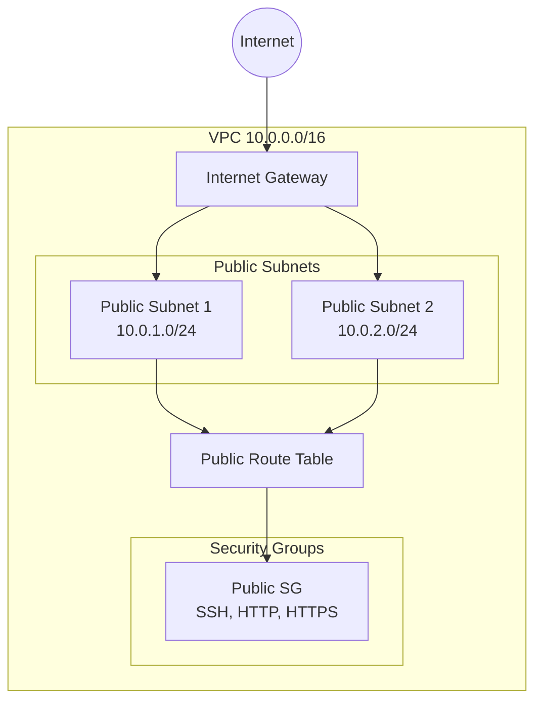
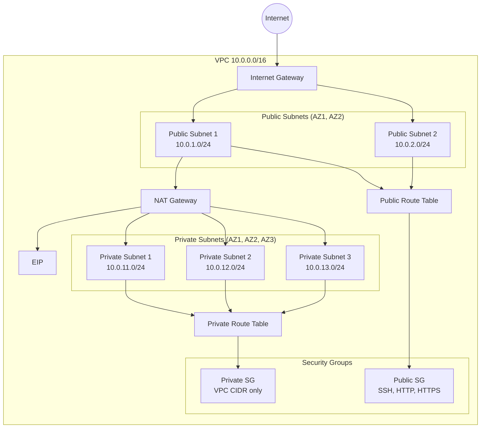

# NetworkComponent Documentation

## Overview

The **NetworkComponent** is a Pulumi TypeScript component that provides flexible VPC networking infrastructure with lazy resource creation patterns. It supports both public-only networks and full private/public subnet architectures.

### Purpose

- Create VPC with configurable CIDR blocks
- Deploy public subnets with Internet Gateway
- Optionally deploy private subnets with NAT Gateway
- Create security groups for public and private access
- Optimize costs by only creating resources when needed

---

## VpcComponent vs NetworkComponent

This library provides two components for different use cases:

### VpcComponent (Minimal)

Creates only the basic VPC resource without any networking infrastructure.

```typescript
import { VpcComponent } from './components/01-network-component';

const vpc = new VpcComponent("myapp", {
  cidrBlock: "10.0.0.0/16",
});
```

**Use when**:
- You need just a VPC ID
- You want to manage all networking manually
- Building custom architectures

### NetworkComponent (Full)

Creates VPC with optional public/private subnets, gateways, and security groups.

```typescript
import { NetworkComponent } from './components/01-network-component';

const network = new NetworkComponent("myapp", {
  cidrBlock: "10.0.0.0/16",
  enablePrivateSubnets: true,
});
```

**Use when**:
- You need standard 3-tier architecture
- Deploying ECS, RDS, or other AWS services
- Need both public and private network access

### Comparison Table

| Feature | VpcComponent | NetworkComponent |
|---------|--------------|-------------------|
| VPC | ✅ | ✅ |
| Internet Gateway | ❌ | ✅ (if public subnets) |
| Public Subnets | ❌ | ✅ (configurable) |
| Private Subnets | ❌ | ✅ (lazy) |
| NAT Gateway | ❌ | ✅ (lazy - costs ~$32/mo) |
| Public Security Group | ❌ | ✅ (lazy) |
| Private Security Group | ❌ | ✅ (lazy) |
| Route Tables | ❌ | ✅ |
| Cost (monthly) | ~$0 | $0-$45+ |

---

## Architecture Diagrams

### Public Subnets Only



### Full Network (Public + Private)



---

## Lazy Creation Patterns

### 1. Private Subnets (`enablePrivateSubnets`)

Private subnets with NAT Gateway are only created when explicitly enabled:

```typescript
// Default: Public-only network (no NAT Gateway cost)
const network = new NetworkComponent("myapp", {
  cidrBlock: "10.0.0.0/16",
  enablePrivateSubnets: false,  // Default
});

// Full network with private subnets (~$32/month NAT Gateway)
const networkFull = new NetworkComponent("myapp", {
  cidrBlock: "10.0.0.0/16",
  enablePrivateSubnets: true,  // Creates NAT Gateway + private subnets
});
```

**Cost Impact**: NAT Gateway adds ~$32/month + data processing charges.

### 2. Security Groups (`createSecurityGroups`)

Security groups are only created if not explicitly disabled:

```typescript
// Default: Creates both public and private SGs
const network = new NetworkComponent("myapp", {
  cidrBlock: "10.0.0.0/16",
  createSecurityGroups: true,  // Default
});

// Skip security group creation (use external SGs)
const network = new NetworkComponent("myapp", {
  cidrBlock: "10.0.0.0/16",
  createSecurityGroups: false,  // No SGs created
});
```

---

## Configuration Options

### TypeScript Interfaces

```typescript
import * as pulumi from '@pulumi/pulumi';

/**
 * Minimal VPC Component Arguments
 */
interface VpcArgs {
  /** VPC CIDR block (e.g., "10.0.0.0/16") */
  cidrBlock: pulumi.Input<string>;
  
  /** Environment tag */
  Environment?: pulumi.Input<string>;
  
  /** Enable DNS support (default: true) */
  enableDnsSupport?: pulumi.Input<boolean>;
  
  /** Enable DNS hostnames (default: true) */
  enableDnsHostnames?: pulumi.Input<boolean>;
}

/**
 * Subnet configuration for custom CIDR/AZ placement
 */
interface SubnetConfig {
  /** Subnet CIDR block */
  cidrBlock: string;
  
  /** Availability zone index (0 = first AZ, 1 = second AZ, etc.) */
  azIndex: number;
}

/**
 * Full Network Component Arguments
 */
interface NetworkArgs {
  /** VPC CIDR block (e.g., "10.0.0.0/16") */
  cidrBlock: pulumi.Input<string>;
  
  /** Environment tag */
  Environment?: pulumi.Input<string>;
  
  /** Enable DNS support (default: true) */
  enableDnsSupport?: pulumi.Input<boolean>;
  
  /** Enable DNS hostnames (default: true) */
  enableDnsHostnames?: pulumi.Input<boolean>;
  
  /** 
   * Enable public subnets and Internet Gateway (default: true)
   * Set to false to create VPC without public access
   */
  enablePublicSubnets?: pulumi.Input<boolean>;
  
  /** 
   * Enable private subnets and NAT Gateway (default: false)
   * WARNING: NAT Gateway costs ~$32/month - only enable when needed
   */
  enablePrivateSubnets?: pulumi.Input<boolean>;
  
  /** 
   * Create default security groups (default: true)
   * Set to false to manage security groups externally
   */
  createSecurityGroups?: pulumi.Input<boolean>;
  
  /** 
   * Your IP address for SSH access (CIDR format)
   * Example: "203.0.113.0/32" or "0.0.0.0/0" for anywhere
   */
  myIpAddress?: pulumi.Input<string>;
  
  /** 
   * Configuration for public subnets
   * Default: 2 subnets in AZ 0,1 with CIDRs 10.0.1.0/24, 10.0.2.0/24
   */
  publicSubnetConfigs?: SubnetConfig[];
  
  /** 
   * Configuration for private subnets
   * Default: 1 subnet in AZ 2 with CIDR 10.0.3.0/24
   */
  privateSubnetConfigs?: SubnetConfig[];
}
```

### Configuration Reference

| Property | Type | Default | Description |
|----------|------|---------|-------------|
| `cidrBlock` | `string` | **required** | VPC CIDR (e.g., "10.0.0.0/16") |
| `Environment` | `string` | `"dev"` | Environment tag |
| `enableDnsSupport` | `boolean` | `true` | Enable DNS resolution in VPC |
| `enableDnsHostnames` | `boolean` | `true` | Enable DNS hostnames |
| `enablePublicSubnets` | `boolean` | `true` | Create public subnets + IGW |
| `enablePrivateSubnets` | `boolean` | `false` | Create private subnets + NAT |
| `createSecurityGroups` | `boolean` | `true` | Create default SGs |
| `myIpAddress` | `string` | `"0.0.0.0/0"` | SSH access IP (CIDR) |
| `publicSubnetConfigs` | `SubnetConfig[]` | 2 subnets | Custom public subnet config |
| `privateSubnetConfigs` | `SubnetConfig[]` | 1 subnet | Custom private subnet config |

---

## Usage Examples

### 1. Public-Only Network (Default)

```typescript
import { NetworkComponent } from './components/01-network-component';

// Creates VPC with public subnets and security groups
const network = new NetworkComponent("myapp", {
  cidrBlock: "10.0.0.0/16",
  myIpAddress: "203.0.113.0/32",  // Your IP for SSH
});

// Export VPC and subnet IDs
export const vpcId = network.vpc.id;
export const publicSubnetIds = network.publicSubnets.map(s => s.id);
export const securityGroupId = network.publicSecurityGroup?.id;
```

### 2. Full Network with Private Subnets

```typescript
import { NetworkComponent } from './components/01-network-component';

// Creates VPC with public + private subnets + NAT Gateway
const network = new NetworkComponent("myapp", {
  cidrBlock: "10.0.0.0/16",
  enablePrivateSubnets: true,
  myIpAddress: "203.0.113.0/32",
  publicSubnetConfigs: [
    { cidrBlock: "10.0.1.0/24", azIndex: 0 },  // us-east-1a
    { cidrBlock: "10.0.2.0/24", azIndex: 1 },  // us-east-1b
    { cidrBlock: "10.0.3.0/24", azIndex: 2 },  // us-east-1c
  ],
  privateSubnetConfigs: [
    { cidrBlock: "10.0.11.0/24", azIndex: 0 },
    { cidrBlock: "10.0.12.0/24", azIndex: 1 },
    { cidrBlock: "10.0.13.0/24", azIndex: 2 },
  ],
});
```

### 3. Minimal VPC (VpcComponent)

```typescript
import { VpcComponent } from './components/01-network-component';

// Creates only VPC - no subnets, gateways, or security groups
const vpc = new VpcComponent("myapp", {
  cidrBlock: "10.0.0.0/16",
  Environment: "prod",
  enableDnsSupport: true,
  enableDnsHostnames: true,
});

export const vpcId = vpc.vpc.id;
```

### 4. Custom Security Groups Disabled

```typescript
import { NetworkComponent } from './components/01-network-component';

// Skip security group creation - use existing ones
const network = new NetworkComponent("myapp", {
  cidrBlock: "10.0.0.0/16",
  enablePrivateSubnets: true,
  createSecurityGroups: false,  // No SGs created
  myIpAddress: "0.0.0.0/0",      // Still used for reference if needed
});
```

---

## Pulumi Configuration (YAML)

### Basic Configuration (Pulumi.dev.yaml)

```yaml
config:
  pulumi-aws-ts:cidrBlock: 10.0.0.0/16
  pulumi-aws-ts:Environment: dev
  pulumi-aws-ts:myIpAddress: 203.0.113.0/32
```

### Full Network Configuration

```yaml
config:
  pulumi-aws-ts:cidrBlock: 10.0.0.0/16
  pulumi-aws-ts:Environment: prod
  pulumi-aws-ts:enablePrivateSubnets: "true"
  pulumi-aws-ts:myIpAddress: 203.0.113.0/32
  pulumi-aws-ts:publicSubnetConfigs:
    - cidrBlock: 10.0.1.0/24
      azIndex: 0
    - cidrBlock: 10.0.2.0/24
      azIndex: 1
    - cidrBlock: 10.0.3.0/24
      azIndex: 2
  pulumi-aws-ts:privateSubnetConfigs:
    - cidrBlock: 10.0.11.0/24
      azIndex: 0
    - cidrBlock: 10.0.12.0/24
      azIndex: 1
    - cidrBlock: 10.0.13.0/24
      azIndex: 2
```

### Minimal VPC Only

```yaml
config:
  pulumi-aws-ts:cidrBlock: 10.0.0.0/16
  pulumi-aws-ts:Environment: dev
  pulumi-aws-ts:enableDnsSupport: "true"
  pulumi-aws-ts:enableDnsHostnames: "true"
```

---

## Exported Properties

| Property | Type | Description |
|----------|------|-------------|
| `vpc` | `aws.ec2.Vpc` | The VPC resource |
| `vpc.id` | `pulumi.Output<string>` | VPC ID |
| `vpc.cidrBlock` | `pulumi.Output<string>` | VPC CIDR block |
| `internetGateway` | `aws.ec2.InternetGateway` | Internet Gateway (if public subnets) |
| `natGateway` | `aws.ec2.NatGateway` | NAT Gateway (if private subnets enabled) |
| `natGatewayEip` | `aws.ec2.Eip` | EIP for NAT Gateway |
| `publicSubnets` | `aws.ec2.Subnet[]` | Public subnet array |
| `privateSubnets` | `aws.ec2.Subnet[]` | Private subnet array |
| `publicRouteTable` | `aws.ec2.RouteTable` | Public route table |
| `privateRouteTable` | `aws.ec2.RouteTable` | Private route table |
| `publicSecurityGroup` | `aws.ec2.SecurityGroup` | Public-facing SG |
| `privateSecurityGroup` | `aws.ec2.SecurityGroup` | Private SG (if private subnets) |

### Output Mapping

```typescript
const network = new NetworkComponent("myapp", {
  cidrBlock: "10.0.0.0/16",
  enablePrivateSubnets: true,
});

// Common outputs
export const vpcId = network.vpc.id;
export const vpcCidr = network.vpc.cidrBlock;

// Public subnets
export const publicSubnetId1 = network.publicSubnets[0].id;
export const publicSubnetId2 = network.publicSubnets[1].id;

// Private subnets
export const privateSubnetId1 = network.privateSubnets[0].id;

// Security groups
export const publicSgId = network.publicSecurityGroup?.id;
export const privateSgId = network.privateSecurityGroup?.id;

// NAT Gateway (only if enablePrivateSubnets: true)
export const natGatewayId = network.natGateway?.id;
```

---

## Cost Comparison

| Configuration | Monthly Cost | Resources Created |
|---------------|--------------|-------------------|
| **Minimal VPC** | $0 | VPC only |
| **Public Only** | $0 | VPC + IGW + 2 Public Subnets + SG |
| **With Private** | ~$32/mo | Above + NAT Gateway + Private Subnets |
| **3-AZ Full** | ~$35-45/mo | Above + 3 AZs + EIP |

### Cost Breakdown

| Resource | Hourly Cost | Monthly (est.) |
|----------|-------------|----------------|
| VPC | $0 | $0 |
| Internet Gateway | $0 | $0 |
| NAT Gateway | $0.045/hr | ~$32/mo |
| EIP (attached) | $0 | $0 |
| Data processing (NAT) | ~$0.045/GB | Varies |
| Security Groups | $0 | $0 |

### Cost Optimization Tips

1. **Disable NAT Gateway when not needed**
   ```typescript
   // Only enable private subnets if ECS tasks need outbound internet
   const network = new NetworkComponent("myapp", {
     cidrBlock: "10.0.0.0/16",
     enablePrivateSubnets: false,  // No NAT Gateway cost
   });
   ```

2. **Use VPC endpoints for AWS services**
   ```typescript
   // Instead of NAT Gateway for S3/DynamoDB access
   // Create VPC endpoints (free for S3, DynamoDB)
   ```

3. **Single NAT Gateway for multiple services**
   ```typescript
   // One network component can be shared across ECS, RDS, etc.
   const network = new NetworkComponent("shared", {
     cidrBlock: "10.0.0.0/16",
     enablePrivateSubnets: true,
   });
   // Reuse for multiple ECS services
   ```

---

## Best Practices

### 1. Use 3 Availability Zones for Production

```typescript
// ✅ Good: Spread across 3 AZs for high availability
const network = new NetworkComponent("prod", {
  cidrBlock: "10.0.0.0/16",
  enablePrivateSubnets: true,
  publicSubnetConfigs: [
    { cidrBlock: "10.0.1.0/24", azIndex: 0 },
    { cidrBlock: "10.0.2.0/24", azIndex: 1 },
    { cidrBlock: "10.0.3.0/24", azIndex: 2 },
  ],
  privateSubnetConfigs: [
    { cidrBlock: "10.0.11.0/24", azIndex: 0 },
    { cidrBlock: "10.0.12.0/24", azIndex: 1 },
    { cidrBlock: "10.0.13.0/24", azIndex: 2 },
  ],
});

// ❌ Avoid: Single AZ deployments in production
```

### 2. Restrict SSH Access

```typescript
// ✅ Good: Restrict to your IP
const network = new NetworkComponent("prod", {
  cidrBlock: "10.0.0.0/16",
  myIpAddress: "203.0.113.0/32",  // Your specific IP
});

// ❌ Avoid: Open SSH from anywhere
// myIpAddress: "0.0.0.0/0"  // NEVER do this in production
```

### 3. Use Private Subnets for Databases

```typescript
// ✅ Good: Databases in private subnets
const network = new NetworkComponent("prod", {
  cidrBlock: "10.0.0.0/16",
  enablePrivateSubnets: true,
});

// RDS Subnet Group uses:
// network.privateSubnets.map(s => s.id)
```

### 4. Share Network Across Services

```typescript
// ✅ Good: Single network, multiple services
const network = new NetworkComponent("shared", {
  cidrBlock: "10.0.0.0/16",
  enablePrivateSubnets: true,
});

const ecs = new EcsComponent("api", {
  vpcId: network.vpc.id,
  subnetIds: network.privateSubnets.map(s => s.id),
  // ...
});

const rds = new DatabaseComponent("db", {
  vpcId: network.vpc.id,
  subnetIds: network.privateSubnets.map(s => s.id),
  // ...
});
```

---

## Related AWS Documentation

- [VPC Documentation](https://docs.aws.amazon.com/vpc/latest/userguide/what-is-amazon-vpc.html)
- [Subnets](https://docs.aws.amazon.com/vpc/latest/userguide/configure-subnets.html)
- [NAT Gateways](https://docs.aws.amazon.com/vpc/latest/userguide/vpc-nat-gateway.html)
- [Internet Gateways](https://docs.aws.amazon.com/vpc/latest/userguide/VPC_Internet_Gateway.html)
- [Security Groups](https://docs.aws.amazon.com/vpc/latest/userguide/security-groups.html)
- [VPC Pricing](https://aws.amazon.com/vpc/pricing/)
- [AWS Regions and Availability Zones](https://aws.amazon.com/about-aws/global-infrastructure/regions_az/)

---

## Troubleshooting

### Common Issues

1. **ECS tasks can't reach internet**: Ensure `enablePrivateSubnets: true` and NAT Gateway is created
2. **Can't SSH to instances**: Check `myIpAddress` is correct and includes your current IP
3. **Resources not in expected AZ**: Verify `azIndex` values match available AZs in your region
4. **DNS not resolving**: Ensure `enableDnsSupport` and `enableDnsHostnames` are true

### Debug Commands

```bash
# Describe VPC
aws ec2 describe-vpcs --vpc-ids vpc-12345678

# Describe Subnets
aws ec2 describe-subnets --filters "Name=vpc-id,Values=vpc-12345678"

# Describe NAT Gateways
aws ec2 describe-nat-gateways --filter "Name=vpc-id,Values=vpc-12345678"

# Check route tables
aws ec2 describe-route-tables --filters "Name=vpc-id,Values=vpc-12345678"

# Describe Security Groups
aws ec2 describe-security-groups --filters "Name=vpc-id,Values=vpc-12345678"
```

---

## Summary

The **NetworkComponent** provides a flexible, cost-optimized approach to AWS networking:

| Use Case | Component | Private Subnets | Monthly Cost |
|----------|-----------|-----------------|--------------|
| Simple web app | NetworkComponent | ❌ | $0 |
| App with external DB | NetworkComponent | ✅ | ~$32 |
| Microservices | NetworkComponent | ✅ | ~$32-45 |
| Custom architecture | VpcComponent | N/A | $0 |

Choose the minimal option that meets your requirements to optimize costs while maintaining security and availability.
